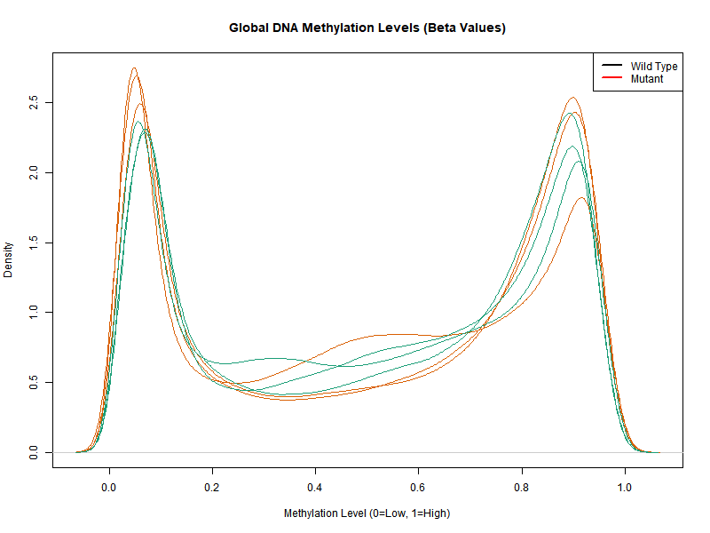
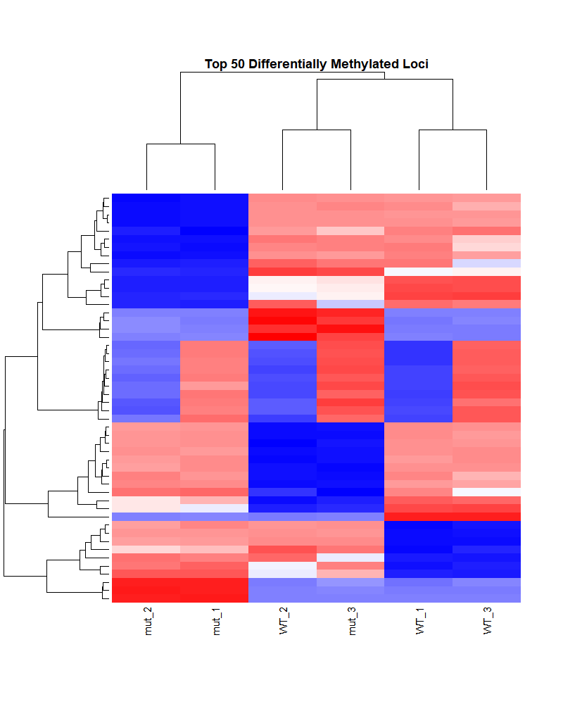

# Epigenetic Profiling: Methylation Landscape Analysis (WGBS)

## 🧬 Project Overview

This repository contains a reproducible bioinformatics pipeline for the **re-analysis of Whole Genome Bisulfite Sequencing (WGBS) data**. The project focuses on dissecting the epigenetic landscape of *Arabidopsis thaliana*, specifically identifying **Differentially Methylated Regions (DMRs)** and analyzing global methylation shifts between Wild Type (WT) and Epigenetic Mutants.

Unlike standard pipelines that rely solely on fractional methylation differences, this workflow integrates **Dispersion Shrinkage for Sequencing data (DSS)**. This statistical approach utilizes Beta-binomial models with spatial smoothing to account for biological variance and sequencing depth, ensuring robust detection of epigenetic regulatory events.

## 📂 Repository Structure

    ├── data/                   # (Excluded) Raw coverage files and Bismark reports
    ├── figures/                # Generated visualizations
    │   ├── methylation_density.png
    │   └── dmr_heatmap.png
    ├── results/
    │   └── Significant_DMRs.csv  # Final output: Genomic coordinates & statistics
    ├── scripts/
    │   └── WGBS_Analysis.R       # Main R/Bioconductor analysis script
    ├── README.md               # Project documentation
    └── LICENSE                 # MIT License

## 🛠️ Methodology & Workflow

The pipeline implements a comprehensive "Raw-to-DMR" strategy:

1.  **Data Pre-processing:**
    * **Trimming:** `Trim Galore!` (Adapter removal & QC).
    * **Alignment:** `Bismark` (v0.22.3) mapping to TAIR10 reference genome.
    * **Methylation Calling:** Extraction of Cytosine methylation in **CpG, CHG, and CHH** contexts.

2.  **Statistical Analysis (R/Bioconductor):**
    * **Quality Control:** Dynamic filtering of PCR duplicates (>99.9th percentile) and low-coverage bases (<10x).
    * **Modeling:** `methylKit` and `DSS` packages used for differential methylation testing.
    * **Smoothing:** Applied spatial correlation filters to detect regional methylation changes rather than isolated SNPs.

## 📊 Key Results

### 1. Global Methylation Shift

*Figure 1: Distribution of Fractional Methylation levels (0 = Unmethylated, 1 = Fully Methylated). The bimodal peaks (characteristic of plant genomes) confirm high-quality methylation calling. A distinct hypomethylation shift is observed in the mutant lines (Red) compared to Wild Type (Black).*

### 2. Differentially Methylated Regions (DMRs)

*Figure 2: Hierarchical clustering of the top 50 most variable methylation regions. The heatmap reveals a distinct epigenetic signature separating the Control and Stress/Mutant groups.*

## 🧬 Data Availability

* **Final Output:** [Significant_DMRs.csv](Significant_DMRs.csv)
    * *Contains:* Chromosome, Start, End, Methylation Difference (LogFC), and FDR-corrected P-values (q-values).

## 💻 Usage

To replicate this analysis, run the primary R script:

    # Load required libraries
    library(methylKit)
    library(DSS)

    # Load coverage files
    file.list <- list("WT_1.cov", "WT_2.cov", "Mut_1.cov", "Mut_2.cov")
    bs_obj <- methRead(file.list, assembly="TAIR10", context="CpG", mincov=10)

    # Filter PCR bias
    filtered_obj <- filterByCoverage(bs_obj, hi.perc=99.9)

    # Perform Differential Methylation Test (Wald Test with Smoothing)
    dml_test <- DMLtest(bs_obj, group1=c("Mutant"), group2=c("WT"), smoothing=TRUE)
    dmrs <- callDMR(dml_test, delta=0.1, p.threshold=0.05)

## 📦 Dependencies

* **R** (>= 4.0.0)
* **methylKit**
* **DSS** (Dispersion Shrinkage for Sequencing data)
* **genomation**
* **ggplot2**

## 👨‍💻 Author

**Anant Kaushal**
*Computational Epigenetics Researcher*
*Specializing in Plant Genomics & Transcriptional Regulation*

---
*© 2026 Anant Kaushal. Licensed under MIT.*
